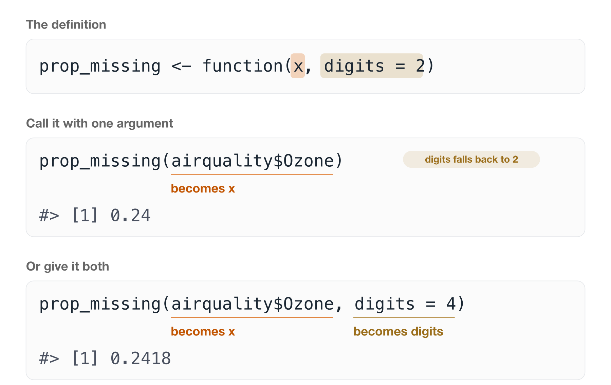

# Anatomy of a function {#sec-anatomy}

A function has a handful of parts, and once you can name all of them you can read anyone's code. This session is about those parts, and about the half of a function a reader meets before they ever look inside it: its name, its arguments, and what you wrote down about it.

::: {.overview}

## Overview {.unnumbered}

**Duration** 60 minutes

**Questions**

<!-- These map onto the sections below, in order. If you move a section, move its question. -->

- What are the parts of a function?
- Where do argument values actually come from?
- What can I tell about a function without reading its body?
- What makes one function easier to live with than another?
- How do I choose a name that explains itself?
- What should I write down about a function, and when?

**What you need this session**

- A session of RStudio open

```{r}
#| label: pkgs
#| output: false
library(purrr)
```

:::

## The four parts

Every function in R is built from the same few pieces.

The reason to learn their names is practical. Knowing a term like "default argument" means you can search for it, read the help page, and ask someone a question that gets you a useful answer. Without the words you are stuck describing the shape of your problem and hoping.

We will use two small functions here. The first counts how many values are missing:

```{r}
#| label: n-missing
n_missing <- function(x) {
  sum(is.na(x))
}

n_missing(airquality$Ozone)
```

The second uses that one to work out what **proportion** is missing:

```{r}
#| label: prop-missing
prop_missing <- function(x, digits = 2) {
  prop <- n_missing(x) / length(x)
  round(prop, digits)
}

prop_missing(airquality$Ozone)
```

Notice that `prop_missing()` calls `n_missing()`. You write a small function that does one thing, then use it inside the next one, instead of writing `sum(is.na(x))` again and hoping you type it the same way.

{fig-alt="The function prop_missing defined with function(x, digits = 2), with six parts highlighted in colour: the name, the function keyword, the argument x, the default digits = 2, the body, and the return value." width=100%}

Taking them one at a time:

- **The name.** `prop_missing`. This is how you call it later, so it is worth spending time on. More on that below.
- **`function()`.** This is what creates a function. The `prop_missing <-` part just gives it a name, the same way you would name any other value.
- **The arguments.** `x` and `digits`. These are the parts that change each time you call it. They are the answer to "what did I keep editing at the top of my script?"
- **A default.** `digits = 2`. If the caller does not supply `digits`, it is 2. Defaults make a function easy to call in the common case without giving up control in the uncommon one.
- **The body.** Everything between the braces. This is the code that runs.
- **The return value.** R hands back the **last thing evaluated**, so here that is the rounded proportion. You can write `return()` explicitly, and sometimes should for an early exit, but you do not have to.

::: {.callout-note title="Your Turn"}

Here is a function. Do not run it, and do not worry about what it computes.

```r
rate_per_1000 <- function(count, population, digits = 1) {
  rate <- (count / population) * 1000
  round(rate, digits)
}
```

Name the parts:

1. What is the **name** of this function?
2. What are its **arguments**?
3. Which argument has a **default**, and what is it?
4. What is the **body**?
5. What does it **return**?
6. Now call it two ways. Once letting `digits` take its default, and once setting it yourself.

This one is really about the vocabulary. Once you can say "the third argument has a default", you can look it up, and you can ask about it.

::: {.callout-tip title="Answer" collapse="true"}

```{r}
#| label: rate-per-1000
rate_per_1000 <- function(count, population, digits = 1) {
  rate <- (count / population) * 1000
  round(rate, digits)
}

rate_per_1000(count = 37, population = 25000)
rate_per_1000(count = 37, population = 25000, digits = 3)
```

The body is the two lines between the braces, and the return value is the rounded rate, because it is the last thing evaluated.

:::

:::

**What to hold onto here.** Name, arguments, defaults, body, return value. Five words that let you talk about any function you meet.

## Values arrive at the call, not the definition

Arguments are the part that trips people up, and I think it's because `x` and `digits` do not have values when you write the definition.

They are names waiting for something.

The values turn up when you call the function, and which value lands on which name is decided by the order you wrote them in.

{fig-alt="Three panels. The first shows the definition prop_missing <- function(x, digits = 2), with x highlighted in orange and digits = 2 in brown. The second shows the call prop_missing(airquality$Ozone), with airquality$Ozone underlined in orange and labelled 'becomes x', a badge noting that digits falls back to 2, and the result 0.24. The third shows prop_missing(airquality$Ozone, digits = 4), with airquality$Ozone labelled 'becomes x' and digits = 4 labelled 'becomes digits', returning 0.2418." width=100%}

Here it is running:

```{r}
#| label: prop-missing-two-ways
prop_missing(airquality$Ozone)
prop_missing(airquality$Ozone, digits = 4)
```

The same function, two different answers, and nothing about the function changed. That is the whole job of an argument.

You can hand values over in two ways. **By position**, in the order the definition lists them, or **by name**, using `name = value`.

{fig-alt="A function definition, prop_missing with arguments x and digits equals two, shown at the top along with ozone being assigned from airquality dollar Ozone. Below it three calls, all returning the same answer. The first passes both values by position and is marked by position, with the note that you have to know the definition to read it. The second names both arguments and is marked by name, the habit worth having. The third names both but puts them in the opposite order, and is marked by name any order, because naming makes order irrelevant." width=100%}

All three give the same answer. What differs is how much you have to already know in order to read the line.

**Name your arguments where you can.** `prop_missing(ozone, 4)` needs you to remember what the second slot is for. `prop_missing(x = ozone, digits = 4)` tells you. The first argument is usually obvious enough to leave positional, and everything after it is worth naming.

This is a @sec-drry argument wearing different clothes. Naming the argument means you do not have to go and re-read the definition to understand the call.

::: {.callout-tip title="Two more parts, once the above is comfortable" collapse="true"}

Worth knowing eventually. Skip them for now if you are still getting used to the parts above.

**Side effects.** Anything a function does *other* than return a value. Printing to the console, writing a file, drawing a plot, setting an option.

Side effects are not bad, and plenty of useful functions have them. The catch is reasoning. A function that returns something useful **and** quietly writes a file is harder to think about than one that does a single one of those things.

**Functions are values.** An argument can itself be a function.

Say you want to know how many values are missing in every column. With what we have, that is one line per column, and you have to know every column name, type each one correctly, and remember to come back when the data gains a column.

What you want to say is "do this to every column":

```{r}
#| label: map-int
map_int(airquality, n_missing)
```

Look closely at how `n_missing` is written there. **No brackets.** We are not calling it, we are handing it over, the same way we would hand over a number or a data frame.

:::

**What to hold onto here.** The definition names the slots. The call fills them. Name the slots when you fill them.

## What a signature communicates

The first line of a function is called its **signature**, and it is doing more work than it looks.

Read these three and see how much you can say without opening any of them:

```r
grams_to_kg(grams)
prop_missing(x, digits = 2)
process(data, config, mode, verbose = FALSE, ...)
```

The first tells you everything. One thing in, one thing out, and the name says which way round.

The second tells you nearly everything. Something goes in, a rounding choice is available, and the default means you can ignore it until you care.

The third tells you almost nothing, and it takes five arguments to do it. What is `mode`? What goes in `...`? You can't call it without reading the body, which means the signature has failed at its only job.

A good signature is a promise that you will not need to look inside. That is what you are aiming for, and it is why the name and the arguments deserve as much thought as the code.

**What to hold onto here.** If you cannot call a function correctly from its signature alone, the signature is the thing to fix.

## Good (simple) function design

Functions are **tools for managing complexity**. That is also called *abstraction*, or abstracting away.

So the question to ask of every function you write is: what complexity am I managing here, and what am I abstracting away?

{fig-alt="A question across the top, what complexity am I managing and what am I abstracting away, described as the question to ask of every function you write. Below it, four cards. Manages complexity: hides detail you do not need while reading this line. Expresses an idea: its name says what it is for, not how it works. Reasoned about alone: you can understand it without reading the rest of the script. Takes iteration: the first version is never the one you keep." width=100%}

Here is a real piece of analysis code. It asks whether temperature differs on days when ozone is missing, compared with days when it was recorded:

```r
is_different <- airquality$Temp
when_missing_index <- which(is.na(airquality$Ozone))
when_complete_index <- which(!is.na(airquality$Ozone))
is_different_miss <- is_different[when_missing_index]
is_different_complete <- is_different[when_complete_index]
result_ozone_temp <- t.test(is_different_miss, is_different_complete)
```

That works. But you can't use it on another pair of variables without editing it, and you can't tell at a glance what it's for.

**Writing a function is writing.** You don't get it right on the first pass, and you're not supposed to.

**Start with the bones.** Make an empty function and paste the code into the body.

```r
misstest <- function(Temp, Ozone) {
  # paste the text into the body
}
```

**Ask what you are interested in.** Which parts change? Here it is the variable being tested, and the variable whose missingness we split on.

**Work out what to name things.** Replace the hard-coded `airquality$Temp` with an argument. Comment the old line out rather than deleting it, so you can see what you are replacing:

```r
misstest <- function(is_different, when_missing) {
  # is_different <- airquality$Temp
  when_missing_index <- which(is.na(when_missing))
  when_complete_index <- which(!is.na(when_missing))
  is_different_miss <- is_different[when_missing_index]
  is_different_complete <- is_different[when_complete_index]
  result_ozone_temp <- t.test(is_different_miss, is_different_complete)
}
```

Naming is tricky, and it's completely fine for it to take a few goes.

**Clean up the old lettuce.** Take the commented-out lines out once you no longer need them.

**Name the function so it evokes the action.** `misstest` was a placeholder. What does this actually do?

```r
missingness_impact <- function(is_different, when_missing) {
  when_missing_index <- which(is.na(when_missing))
  when_complete_index <- which(!is.na(when_missing))
  is_different_miss <- is_different[when_missing_index]
  is_different_complete <- is_different[when_complete_index]
  t.test(is_different_miss, is_different_complete)
}
```

**Then use it**, and write the output to a variable:

```r
temp_difference_ozone_missing <- missingness_impact(
  when_missing = airquality$Ozone,
  is_different = airquality$Temp
)
```

The process, in short:

1. **Copy** the text into the body.
2. **Identify** the complexity to manage.
3. **Abstract** that complexity.
4. **Iterate**, because writing functions is iterative, just like ordinary writing.

{fig-alt="Four steps stacked in a column, joined by arrows. Copy: paste the code into an empty function body and change nothing. Identify: work out which parts change between uses, because those are the arguments. Abstract: replace the hard-coded parts with argument names. Iterate: get it working first, then improve the names. A curved arrow labelled again runs from Iterate back up to Identify, because the middle two steps repeat." width=100%}

::: {.callout-note title="Your Turn"}

Use one of these. Both do the same thing more than once, with something small changed each time.

**One**

```r
adelie <- penguins[penguins$species == "Adelie", ]
adelie_mean <- mean(adelie$body_mass, na.rm = TRUE)

gentoo <- penguins[penguins$species == "Gentoo", ]
gentoo_mean <- mean(gentoo$body_mass, na.rm = TRUE)

chinstrap <- penguins[penguins$species == "Chinstrap", ]
chinstrap_mean <- mean(chinstrap$body_mass, na.rm = TRUE)
```

**Two**

```r
ozone_high <- airquality$Ozone > 30
ozone_pct <- round(sum(ozone_high, na.rm = TRUE) / sum(!is.na(ozone_high)) * 100, 1)

temp_high <- airquality$Temp > 80
temp_pct <- round(sum(temp_high, na.rm = TRUE) / sum(!is.na(temp_high)) * 100, 1)
```

The second has two things changing rather than one, so it needs two arguments. Work out which they are before you start typing.

1. **Copy.** Make an empty function and paste the chunk into the body. Change nothing yet.
2. **Identify.** Which parts change between uses? Those are your arguments.
3. **Abstract.** Replace the hard-coded parts with argument names.
4. **Iterate.** Get it working first, then improve the names.

Then call your function and check you get the same answer you got before you started. That check matters. It's very easy to tidy something into a different result.

:::

**What to hold onto here.** Copy, identify, abstract, iterate. The first version is never the one you keep.

## Naming things

A function **does** something, so its name should say what.

Watch this one improve:

```r
myfun()                    # what?
temperature_conversion()   # better, but converting what to what?
celsius_to_fahrenheit()    # now I do not have to read the body
```

The pattern that gets you there is **`input_to_output()`**. Not every function fits it, and reaching for it is still the fastest way I know to find out whether you understand what your function does. If you can't fill in both halves, that's worth knowing before you write the body.

The same care goes inside:

```{r}
#| label: celsius
celsius_to_fahrenheit <- function(celsius) {
  fahrenheit <- (celsius * 9 / 5) + 32
  fahrenheit
}

celsius_to_fahrenheit(21)
```

Read that and there is nothing left to work out. The argument says what goes in, the intermediate says what comes out, and the name says what happened in between.

Two habits worth having:

- **Name for the question, not the method.** `prop_missing()`, not `round_na_ratio()`. The method will change, and the question won't.
- **Verbs for functions, nouns for the things they return.** `center_scale()` gives you `bill_len_0`.

## Documenting as design

Here's the part people put off, on the grounds that documentation is something you write afterwards, for someone else.

I want to argue the opposite. The most useful documentation is written **before** the body, and the person it is for is you.

The convention in R is roxygen, which is a specially formatted comment sitting above the function. It looks like this:

```{r}
#| label: prop-missing-documented
#' What proportion of a vector is missing?
#'
#' @param x A vector.
#' @param digits Number of decimal places to round to. Defaults to 2.
#'
#' @return A single number between 0 and 1.
prop_missing <- function(x, digits = 2) {
  prop <- n_missing(x) / length(x)
  round(prop, digits)
}
```

Now look at what those three tags actually asked you.

`@param x` asked **what kind of thing goes in here**. If the honest answer is "a vector, or a data frame, or sometimes a list", you have found a design problem before you wrote a line of the body.

`@return` asked **what comes out**. If you can't answer in one short phrase, the function is doing more than one thing.

And the title line asked you to say what it is for, in a sentence. That's the same sentence you'd use for the name.

So roxygen isn't paperwork. It is three questions that catch a bad design early, and you happen to get documentation out of the other end.

::: {.callout-warning title="This is not package documentation"}

Writing an R package turns these comments into help pages, so `?prop_missing` works. That needs `devtools::document()`, a `DESCRIPTION` file, and a few other things, and that's a different course.

Here we are writing analysis code. The comments live above the function, in a file in `R/`, and nobody ever runs `document()`. They are notes to your future self, sitting exactly where that person will be looking.

The format is worth using anyway, because it's the one everyone else uses, and because it'll already be right on the day you do want a package.

:::

`{fnmate}` writes this skeleton for you. Put your cursor on a call to a function that does not exist yet, press the key you bound it to, and it creates the definition, in the right file, with the arguments filled in.

That matters more than the typing it saves, I think. It means you can write the call you *wish* existed, and then make it exist, rather than stopping to define things before you know what you want.

We use that properly in @sec-outside-in.

::: {.callout-note title="Your Turn"}

Take the function you wrote in the last exercise.

1. Write the roxygen block above it. Title, one `@param` per argument, and a `@return`.
2. Do it in that order, and notice which one is hardest to answer.
3. If `@return` took you more than a sentence, look at whether the function is doing two things.

If `{fnmate}` installed for you, try it too. Type a call to a function you have not written yet, and let it write the skeleton.

:::

**What to hold onto here.** Write the documentation first, and let it interrogate the design while there is still time to change it.

## Summary {.unnumbered}

1. **Name, arguments, defaults, body, return value.** Learn the words so you can look things up and ask questions.
2. **Values arrive at the call.** The definition only names the slots.
3. **Name your arguments** when you call something. It saves the reader a trip to the definition.
4. **A signature is a promise** that the reader will not need to look inside.
5. **Copy, identify, abstract, iterate.** Writing functions is writing, and first drafts are first drafts.
6. **Document before you implement.** `@param` and `@return` are design questions with a useful by-product.
