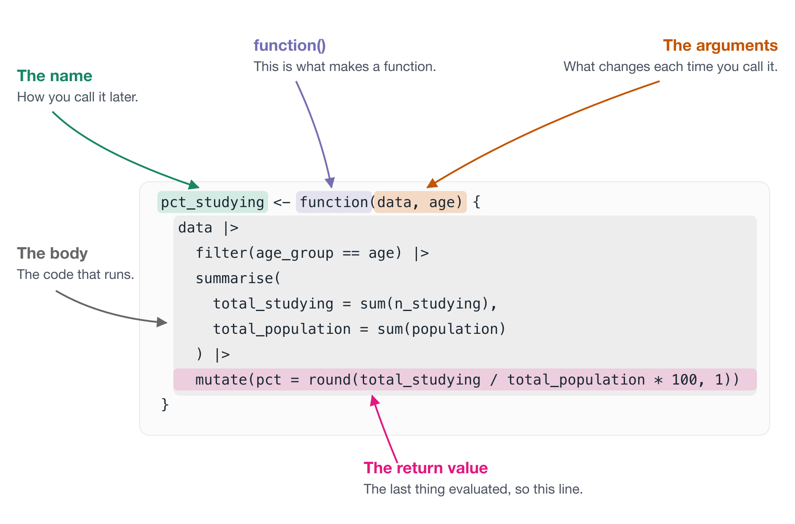
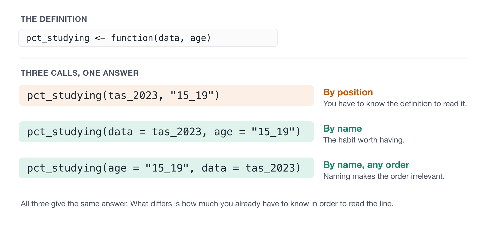

# Anatomy of a function {#sec-anatomy}

This chapter is more specifically about naming the parts of a function.

Knowing the name of something, means you can look it up, ask about it, and read the help page.

::: {.overview}

## Overview {.unnumbered}

**Duration** 60 minutes

**Questions**

<!-- These map onto the sections below, in order. If you move a section, move its question. -->

- What are the parts of a function called?
- How do I give an argument a sensible default?
- How do I pass values in, and does the order matter?
- How do I write one function that works on any column?
- How do I choose a good name?

**What you need this session**

- A session of RStudio open, in the same folder as last time

```{r}
#| label: pkgs
#| output: false
library(dplyr)
library(readr)
library(ggplot2)
library(glue)
library(here)
```

```{r}
#| label: setup-data
#| output: false
education_path <- function(year) {
  here(glue("data/tidy/education_{year}.csv"))
}

year_from_path <- function(path) {
  basename(path) |>
    parse_number() |>
    as.character()
}

read_education <- function(year) {
  files <- education_path(year)
  education_raw <- read_csv(files, id = "path")

  education_raw |>
    mutate(year = year_from_path(path)) |>
    select(-path)
}

education <- read_education(2014:2023)

ed_2023 <- education |>
  filter(year == 2023)

tas_2023 <- education |>
  filter(year == 2023, state_territory == "Tas.")
```

:::

## What we are making

Two plots. Look at them, and then look at the code underneath.

```{r}
#| label: fig-teaser-age
#| echo: false
#| fig-alt: "A horizontal bar chart of the proportion of people studying in Tasmania in 2023, broken down by age group, with green bars and percentage labels."
plot_study_by <- function(data, y) {
  ggplot(data, aes(x = prop_studying, y = {{ y }})) +
    geom_col(fill = "#1B9E77") +
    scale_x_continuous(labels = scales::percent) +
    labs(x = "Studying", y = NULL) +
    theme_minimal(base_size = 12)
}

plot_study_by(tas_2023, y = age_group)
```

```{r}
#| label: fig-teaser-state
#| echo: false
#| fig-alt: "A horizontal bar chart of the proportion of 15 to 19 year olds studying in 2023, broken down by state and territory, in the same style as the previous plot."
education |>
  filter(year == 2023, age_group == "15_19") |>
  plot_study_by(y = state_territory)
```

```r
plot_study_by(tas_2023, y = age_group)

education |>
  filter(year == 2023, age_group == "15_19") |>
  plot_study_by(y = state_territory)
```

**One function.** Two different plots! What changed is what variable goes on the y axis.

That can be tricky! Have you ever tried to write a function around `dplyr` or `ggplot2`? We will talk through how to solve this.

First, the parts of a function.

## The parts of a function

Let's answer a question with the data you read in last session. What percentage of 15 to 19 year olds are studying?

```{r}
#| label: pct-inline
ed_2023 |>
  filter(age_group == "15_19") |>
  summarise(
    total_studying = sum(n_studying),
    total_population = sum(population)
  ) |>
  mutate(pct = round(total_studying / total_population * 100, 1))
```

Now I want it for another age group, and I am not typing that again. So it becomes a function.

```{r}
#| label: pct-studying
pct_studying <- function(data, age) {
  data |>
    filter(age_group == age) |>
    summarise(
      total_studying = sum(n_studying),
      total_population = sum(population)
    ) |>
    mutate(pct = round(total_studying / total_population * 100, 1))
}

pct_studying(ed_2023, age = "25_29")
```

Five parts, and here they are.

- **The name** is `pct_studying`. This is how you call it later.
- **`function()`** is what makes a function. The `pct_studying <-` bit just gives it a name, the same way you'd name any other value.
- **The arguments** are `data` and `age`. These are the parts that change between calls.
- **The body** is everything between the braces. This is the code that runs.
- **The return value** is whatever the body evaluates last, so here that is the one row table coming out of `mutate()`. You can write `return()` if you want, and you'll rarely need to.

The **signature** is the name plus the argument names: `pct_studying(data, age)`. That one line is what most people read before deciding whether they can use your function, so it is worth more thought than the body.

{fig-alt="The function pct_studying, defined as function(data, age), with five parts labelled in colour: the name, the keyword function, the arguments, the body, and the return value, which is the final mutate line." width=100%}

::: {.callout-tip title="Going deeper: side effects" collapse="true"}

A **side effect** is anything a function does other than return a value. Printing to the console, writing a file, drawing a plot, setting an option.

Side effects aren't bad, and plenty of useful functions have them. `plot_study_by_age()` is all side effect.

The catch is reasoning. A function that returns something useful **and** quietly writes a file is harder to think about than one that does a single one of those things.

:::

::: {.callout-tip title="Going deeper: functions are values" collapse="true"}

An argument can be a function. You hand it over without brackets, the same way you would hand over a number.

```{r}
#| label: functions-as-values
summarise_column <- function(x, f) {
  f(x, na.rm = TRUE)
}

summarise_column(education$prop_studying, f = mean)
summarise_column(education$prop_studying, f = max)
```

We are not calling `mean` there, we are passing it. That is what people mean when they say functions are values, and it is how `map()` and `lapply()` work.

:::

### Takehomes

- The parts are the name, the arguments, the body, and the return value
- A function returns whatever its body evaluates last
- The signature is the name plus the argument names
- Knowing the words means you can search for them and ask about them

## Default values

Let's explore defaults using plots.

```{r}
#| label: fig-plain
#| fig-alt: "A plain horizontal bar chart of the proportion studying in Tasmania in 2023 by age group, with raw column names as axis labels."

tas_2023

ggplot(tas_2023, aes(x = prop_studying, y = age_group)) +
  geom_col()
```

ggplot2 expressed itself well, it is a pleasure to write, so wrapping that in a function would not buy much. **"Make everything a function"** is not always the answer.

What changes the calculus is everything you do next. The axis labels are column names, the x axis should be a percentage, and it could use a title and a colour that is not battleship grey. None of that is hard, all of it is fiddly, and none of it is something you want to retype for the ACT and then again for New South Wales.

```{r}
#| label: plot-study-by-age
plot_study_by_age <- function(data, state) {
  ggplot(data, aes(x = prop_studying, y = age_group)) +
    geom_col(fill = "#1B9E77") +
    scale_x_continuous(labels = scales::percent) +
    labs(
      x = "Studying",
      y = "Age group",
      title = "Proportion of people studying, by age group",
      subtitle = state
    ) +
    theme_minimal(base_size = 12)
}

plot_study_by_age(tas_2023, state = "Tas.")
```

Now the fiddly decisions live in one place. But look at how you have to call it.

```r
plot_study_by_age(tas_2023, state = "Tas.")
```

You said Tasmania twice, once to filter the data and again to label the plot. That's exactly the kind of thing that goes wrong later, when you change one and forget the other.

An argument can have a **default**, which is the value it takes when the caller does not give one.

```{r}
#| label: default-state
plot_study_by_age <- function(data, state = "Tas.") {
  ggplot(data, aes(x = prop_studying, y = age_group)) +
    geom_col(fill = "#1B9E77") +
    scale_x_continuous(labels = scales::percent) +
    labs(
      x = "Studying",
      y = "Age group",
      title = "Proportion of people studying, by age group",
      subtitle = state
    ) +
    theme_minimal(base_size = 12)
}
```

The default here is "Tas."

```{r}
#| label: fig-default-state
#| fig-alt: "A horizontal bar chart of study rates by age group in Tasmania in 2023, with the subtitle reading Tas. filled in automatically from the data."
plot_study_by_age(tas_2023)
```

The subtitle says "Tas." and I never typed it, because the default was specified

We could change that to:

```{r}
plot_study_by_age(tas_2023, state = "Tasmania, 2023")
```

That's what defaults are for. They make the common case easy without taking away control in the uncommon one.

### Takehomes

- A default is the value an argument takes when the caller does not supply one
- Defaults can be worked out from the other arguments
- Give the common case a default, and let people override it
- Two arguments that must agree with each other are a bug waiting to happen

## Giving values to arguments

Arguments are names waiting for a value. The values turn up when you call the function, and you can hand them over two ways.

**By position**, in the order the definition lists them:

```{r}
#| label: by-position
pct_studying(tas_2023, "15_19")
```

**By name**, using `name = value`:

```{r}
#| label: by-name
pct_studying(data = tas_2023, age = "15_19")
```

Once they're named, the order stops mattering:

```{r}
#| label: by-name-reordered
pct_studying(age = "15_19", data = tas_2023)
```

And you can mix the two:

```{r}
#| label: mixed
pct_studying(tas_2023, age = "15_19")
```

All four give `r pct_studying(tas_2023, age = "15_19")`. What differs is how much you need to already know in order to read the line.

{fig-alt="A function definition shown at the top, then three calls that all return the same answer. The first passes both values by position and is marked by position, with a note that you have to know the definition to read it. The second names both arguments and is marked by name. The third names both in the opposite order and is marked by name, any order." width=100%}

`pct_studying(tas_2023, "15_19")` needs you to remember what the second slot is for. `pct_studying(tas_2023, age = "15_19")` tells you.

I leave the first argument positional, because it's nearly always the data and nobody is confused by it. Everything after that, I name.

### Takehomes

- You can pass arguments by position or by name
- Naming them means the order does not matter
- Leave the first one positional, name the rest
- A named argument saves your reader a trip to the definition

## Making a function work on any column

`plot_study_by_age()` has a problem. It always plots `age_group`.

If I want the same plot broken down by state instead, I'm back to copying the whole function and changing one word, which is where we came in.

So let's try the obvious thing and pass the column as an argument.

```{r}
#| label: broken-column
#| error: true
plot_study_by <- function(data, y) {
  ggplot(data, aes(x = prop_studying, y = y)) +
    geom_col()
}

plot_study_by(tas_2023, y = age_group)
```

**You should get an error.** That isn't you doing it wrong, and it's the wall that stops a lot of people writing functions around `dplyr` and `ggplot2`.

The problem is that `age_group` is not a value sitting in your workspace. It's a column name, and it only means anything once you're inside the data. R tries to look it up before it ever gets there.

The fix is to wrap the argument in two sets of braces, which people say out loud as **curly curly**.

```{r}
#| label: fig-curly-curly
#| fig-alt: "A horizontal bar chart of study rates by age group in Tasmania, produced by a function that takes the column to plot as an argument."
plot_study_by <- function(data, y) {
  ggplot(data, aes(x = prop_studying, y = {{ y }})) +
    geom_col(fill = "#1B9E77") +
    scale_x_continuous(labels = scales::percent) +
    labs(x = "Studying", y = NULL) +
    theme_minimal(base_size = 12)
}

plot_study_by(tas_2023, y = age_group)
```

`{{ y }}` means "do not look this up yet, pass it through to the data". That's all you need to know today, and it works the same way in `dplyr`.

```{r}
#| label: mean-by
mean_by <- function(data, group) {
  data |>
    group_by({{ group }}) |>
    summarise(mean_prop = round(mean(prop_studying), 3), .groups = "drop")
}

mean_by(filter(education, year == 2023), group = state_territory)
```

And now the same plotting function does a different job entirely:

```{r}
#| label: fig-by-state
#| fig-alt: "A horizontal bar chart of study rates by state and territory for 15 to 19 year olds in 2023, produced by the same function used for the age group plot."
education |>
  filter(year == 2023, age_group == "15_19") |>
  plot_study_by(y = state_territory)
```

Notice I renamed it. `plot_study_by_age()` was true when it only did age groups, and it stopped being true the moment we added that argument. `plot_study_by()` is honest again.

That's normal. The first name you pick is rarely the one you keep, and renaming is part of writing a function rather than a sign you've got it wrong.

You can read more about curly curly at:

- My blog post: [Curly Curly: How to pass bare variable arguments to things?](https://www.njtierney.com/posts/2019-07-06-curly-curly-bare-vars/)
- The dplyr documentation: [Programming with dplyr](https://dplyr.tidyverse.org/articles/programming.html)
- ggplot2 docs: [ggplot2 in packages](https://ggplot2.tidyverse.org/articles/ggplot2-in-packages.html)

::: {.callout-note title="Your Turn"}

<details>
<summary>Setup code</summary>

```r
library(dplyr)
library(readr)
library(ggplot2)
library(glue)
library(here)

education_path <- function(year) {
  here(glue("data/tidy/education_{year}.csv"))
}

year_from_path <- function(path) {
  basename(path) |>
    parse_number() |>
    as.character()
}

read_education <- function(year) {
  files <- education_path(year)
  education_raw <- read_csv(files, id = "path")

  education_raw |>
    mutate(year = year_from_path(path)) |>
    select(-path)
}

education <- read_education(2014:2023)
tas_2023 <- education |> filter(year == 2023, state_territory == "Tas.")

plot_study_by <- function(data, y) {
  ggplot(data, aes(x = prop_studying, y = {{ y }})) +
    geom_col(fill = "#1B9E77") +
    scale_x_continuous(labels = scales::percent) +
    labs(x = "Studying", y = NULL) +
    theme_minimal(base_size = 12)
}
```

</details>

1. Use `plot_study_by()` on the ACT in 2023, broken down by `age_group`.
2. Write `mean_by()` yourself, and use it to get the mean by `age_group`.
3. Give `plot_study_by()` a default for `y`, so that `plot_study_by(tas_2023)` works with no second argument.

<details>
<summary>Answer</summary>

```r
act_2023 <- education |> filter(year == 2023, state_territory == "ACT")
plot_study_by(act_2023, y = age_group)

mean_by <- function(data, group) {
  data |>
    group_by({{ group }}) |>
    summarise(mean_prop = round(mean(prop_studying), 3), .groups = "drop")
}

mean_by(filter(education, year == 2023), group = age_group)
```

For step 3, the default goes in the signature the same as any other:

```r
plot_study_by <- function(data, y = age_group) {
  ggplot(data, aes(x = prop_studying, y = {{ y }})) +
    geom_col(fill = "#1B9E77")
}
```

</details>

:::

### Takehomes

- Column names are not values, so passing them straight in does not work
- Wrap the argument in `{{ }}` to pass a column through to `dplyr` or `ggplot2`
- One function then covers every column instead of one
- When a function outgrows its name, rename it

## Naming things

A function does something, so its name should say what.

Watch this one improve.

```r
myfun()            # what?
study_plot()       # better, but what does it do with it?
plot_study_by()    # now I do not have to read the body
```

The pattern that gets you there is **`verb_noun()`**. Not every function fits it, and reaching for it is still the fastest way to find out whether you know what your function does. If you can't fill in the verb, you probably have two functions.

Two habits worth having.

**Name for the question, not the method.** `pct_studying()`, not `sum_divide_round()`. The method will change, and the question won't.

**Name the insides too.** Look back at `pct_studying()`. It says `studying <- sum(...)` and `people <- sum(...)`, so the division reads as studying over people. That is a choice, and I think it is worth it

### Takehomes

- `verb_noun()` is a good default shape
- Name for the question, not the method
- The names inside the body matter as much as the one outside
- If you cannot name it, you probably have two functions

## Summary {.unnumbered}

1. **The parts are name, arguments, body, return value.** The signature is the name plus the argument names.
2. **Defaults make the common case easy.** They can be worked out from the other arguments.
3. **Name your arguments** when you call something, except the first.
4. **`{{ }}` passes a column name through** to `dplyr` and `ggplot2`.
5. **Renaming is part of writing.** When a function outgrows its name, change it.
